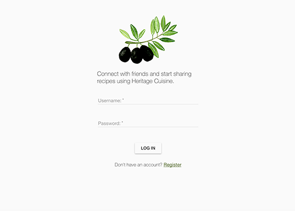
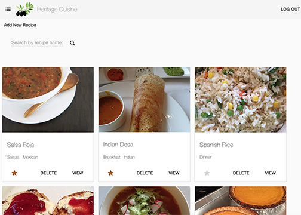
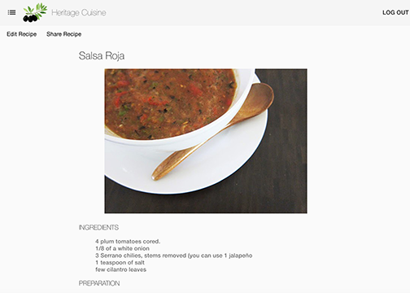
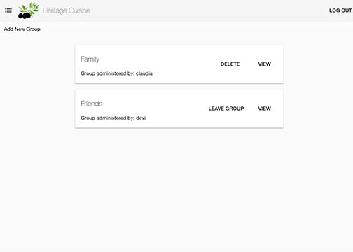
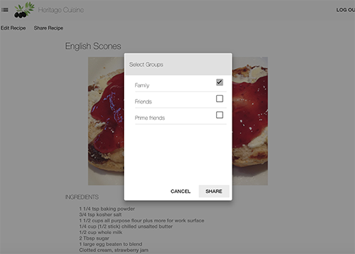

# Heritage Cuisine - Recipe storing and sharing App (MEAN Stack)
## Prime Digital Academy Full Stack Engineering Program - Solo Project

## Application Overview
Heritage Cuisine is a full-stack web application to store and share recipes. It provides an easy way to organize and save recipes and have them accessible from your mobile device. It also allows sharing recipes within groups defined by the user.

Heritage Cuisine allows families to preserve and expand their culinary traditions.

## Application Features

**1. Recipe Book**
- 1.1 General Users sign in/sign up

- 1.2 Ability to create, display, update and delete recipes by user

**2. Social Platform to share recipes**
- 2.1 Group creation and administration

- 2.2 Recipe Sharing

## Technologies
- MongoDB
- Express
- AngularJS
- Node.js
- Angular Material
- Grunt
- ng-file-upload
- multer and multer-s3
- Heroku
- mLab
- Amazon Web Services (for picture storage)

## Setup
1. Clone the repo to your computer using `git clone https://github.com/claudiacalderas/heritage_cuisine.git`
2. Run `npm install`
3. Run `grunt`
4. If running the app locally, ensure Mongo is running `mongod`
